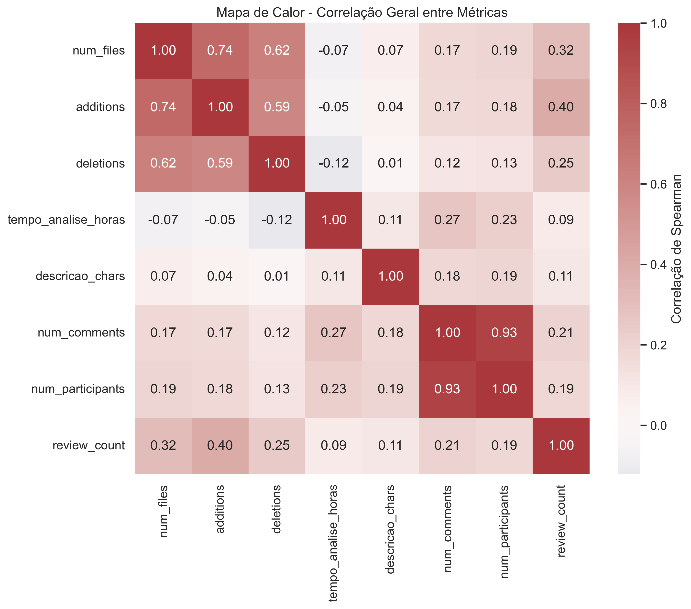
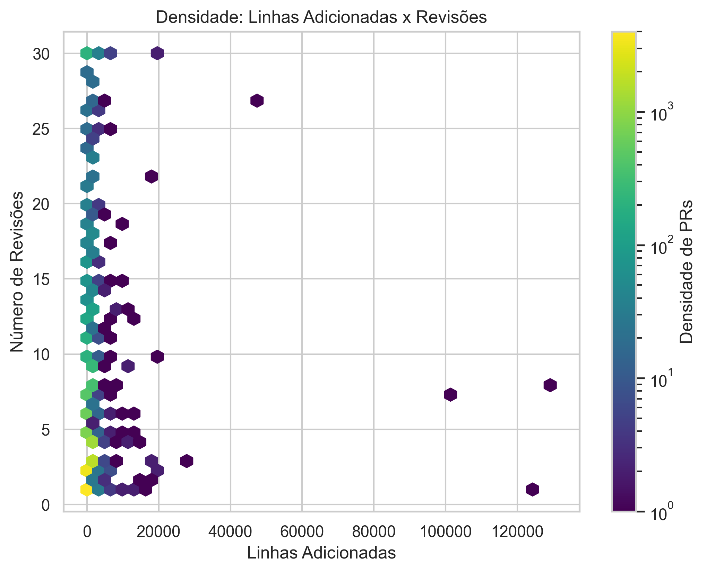
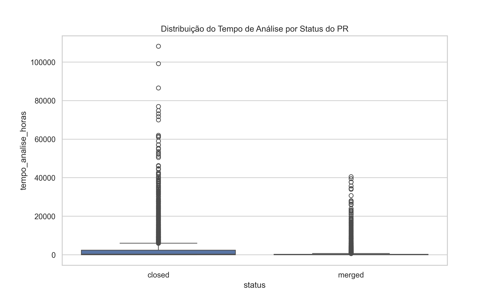

# Laboratório 03 — Caracterizando a Atividade de Code Review no GitHub

## Introdução e Contextualização

A prática de code review é essencial em projetos de software colaborativos, pois permite a detecção precoce de defeitos e a disseminação de conhecimento entre os desenvolvedores.  
Neste laboratório, o objetivo é analisar a atividade de code review em repositórios populares do GitHub, buscando entender quais fatores influenciam o resultado (merge ou close) e o número de revisões realizadas em Pull Requests (PRs).

O dataset analisado foi obtido a partir de PRs coletados de múltiplos repositórios públicos e inclui métricas relacionadas ao tamanho do PR, tempo de análise, descrição e nível de interação entre participantes.

As análises estatísticas e correlações foram calculadas com o coeficiente de Spearman, permitindo avaliar tendências monotônicas entre as variáveis sem assumir linearidade.

---

## Questões de Pesquisa e Hipóteses

### Dimensão A — Feedback Final das Revisões (Status do PR)

| Questão | Descrição | Hipótese |
|----------|------------|-----------|
| RQ01 | Qual a relação entre o tamanho dos PRs e o feedback final das revisões? | PRs maiores (mais arquivos e linhas alteradas) tendem a ser menos aceitos (merge) devido à maior complexidade e risco de falhas. |
| RQ02 | Qual a relação entre o tempo de análise dos PRs e o feedback final das revisões? | PRs que permanecem mais tempo em revisão têm menor probabilidade de serem aprovados, indicando possíveis dificuldades de entendimento ou desacordo entre revisores. |
| RQ03 | Qual a relação entre a descrição dos PRs e o feedback final das revisões? | PRs com descrições mais detalhadas tendem a ser mais aceitos, pois facilitam o entendimento do revisor. |
| RQ04 | Qual a relação entre as interações nos PRs e o feedback final das revisões? | PRs com mais interações (comentários e participantes) podem ter maior chance de rejeição, já que discussões extensas podem indicar controvérsias. |

---

### Dimensão B — Número de Revisões

| Questão | Descrição | Hipótese |
|----------|------------|-----------|
| RQ05 | Qual a relação entre o tamanho dos PRs e o número de revisões realizadas? | PRs maiores demandam mais revisões, pois envolvem mais código e maior risco de problemas. |
| RQ06 | Qual a relação entre o tempo de análise dos PRs e o número de revisões realizadas? | PRs com tempo de análise maior tendem a ter mais revisões, refletindo um processo de revisão mais cuidadoso. |
| RQ07 | Qual a relação entre a descrição dos PRs e o número de revisões realizadas? | PRs com descrições mais longas podem ter menos revisões, pois já explicam adequadamente as mudanças. |
| RQ08 | Qual a relação entre as interações nos PRs e o número de revisões realizadas? | PRs com mais interações (comentários e participantes) devem ter mais revisões, devido à colaboração e troca de feedbacks. |

---

## Metodologia

1. **Coleta dos Dados:**  
   - Foram extraídos PRs de repositórios populares no GitHub com pelo menos 100 PRs concluídos (merged ou closed).  
   - Foram filtrados apenas PRs com pelo menos uma revisão e tempo de análise superior a 1 hora.

2. **Métricas Consideradas:**  
   - Tamanho: `num_files`, `additions`, `deletions`  
   - Tempo de análise: `tempo_analise_horas`  
   - Descrição: `descricao_chars`  
   - Interações: `num_comments`, `num_participants`  
   - Revisões: `review_count`  
   - Status: `status` (1 = merged, 0 = closed)

3. **Análise Estatística:**  
   - Cálculo das medianas para caracterização geral.  
   - Cálculo de correlações de Spearman para medir a intensidade das relações entre as variáveis e os resultados.

4. **Ferramentas Utilizadas:**  
   - Python 3.13, Pandas, Matplotlib, Seaborn, SciPy.

---

## Resultados Encontrados

### Estatísticas Gerais (medianas)

| Métrica | Mediana |
|----------|----------|
| Tempo de análise (h) | 94.06 |
| Número de revisões | 2 |
| Arquivos modificados | 2 |
| Linhas adicionadas | 28 |
| Linhas removidas | 4 |
| Descrição (caracteres) | 601 |
| Comentários | 2 |
| Participantes | 2 |

---

### Correlações com o Status (Spearman)

| Métrica | Correlação |
|----------|-------------|
| Tamanho (Arquivos) | +0.140 |
| Tamanho (Additions) | +0.107 |
| Tamanho (Deletions) | +0.132 |
| Tempo de Análise (h) | −0.272 |
| Descrição (chars) | +0.017 |
| Interações (Comentários) | −0.108 |
| Interações (Participantes) | −0.090 |

**Interpretação:**  
- Pequenas correlações positivas entre tamanho e status sugerem que PRs maiores não são necessariamente rejeitados.  
- Correlação negativa entre tempo e status reforça a hipótese de que PRs demorados tendem a ser menos aceitos.  
- Descrição quase neutra indica que o tamanho da descrição não influencia fortemente na aceitação.

---

## Visualizações

A seguir estão as três principais representações gráficas utilizadas na análise, cobrindo diferentes perspectivas das relações entre variáveis.

### 1. Mapa de Calor — Correlação Geral entre Métricas
O mapa de calor mostra como cada métrica se relaciona com as demais de forma quantitativa.  
Cores mais quentes representam correlações positivas, enquanto cores frias representam correlações negativas.

---

### 2. Gráfico de Densidade Hexbin — Linhas Adicionadas x Número de Revisões
Este gráfico mostra a concentração de PRs com base em duas variáveis numéricas, permitindo identificar zonas com maior frequência de valores combinados.

---

### 3. Boxplot — Distribuição do Tempo de Análise por Status do PR
O boxplot ajuda a visualizar a variação do tempo de análise entre PRs aceitos (merged) e PRs fechados (closed).

---

## Conclusão e Avaliação das Hipóteses

| Questão | Hipótese Confirmada? | Observação |
|----------|----------------------|-------------|
| RQ01 | Parcialmente | PRs maiores mostraram leve tendência a serem aceitos, contrariando a expectativa inicial de rejeição. |
| RQ02 | Confirmada | PRs analisados por mais tempo tiveram menor taxa de merge (correlação negativa). |
| RQ03 | Rejeitada | O tamanho da descrição não mostrou influência significativa sobre o resultado. |
| RQ04 | Confirmada | Mais interações correlacionam-se levemente com rejeições, sugerindo maior discussão e divergência. |
| RQ05 | Confirmada | PRs maiores exigem mais revisões. |
| RQ06 | Confirmada | Tempo de análise mais longo está relacionado a mais revisões. |
| RQ07 | Rejeitada | Descrições longas não reduziram revisões; na prática, houve leve aumento. |
| RQ08 | Confirmada | PRs com mais interações também apresentaram mais revisões. |

---

## Discussão

Os resultados confirmam que o tamanho do PR e o tempo de análise são fatores centrais na dinâmica de code review.  
O tamanho influencia tanto na probabilidade de merge quanto na quantidade de revisões, enquanto o tempo de análise indica maior esforço e discussão.

A hipótese de que descrições mais completas facilitariam a aprovação não se confirmou, indicando que a clareza textual pode não compensar a complexidade técnica.  
Por outro lado, a presença de mais revisores e comentários sugere processos colaborativos e criteriosos, típicos de projetos maduros.

De forma geral, a análise empírica mostra que:
- PRs pequenos e objetivos têm maior chance de serem aceitos rapidamente.  
- PRs grandes e discutidos tendem a exigir mais revisões antes da integração.

Essas evidências reforçam boas práticas conhecidas em engenharia de software: manter PRs pequenos, bem delimitados e com propósito claro melhora a eficiência do processo de revisão.

---